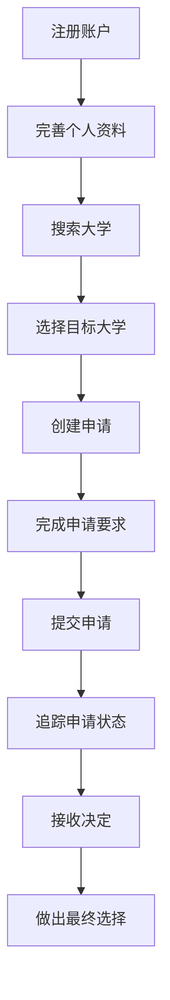
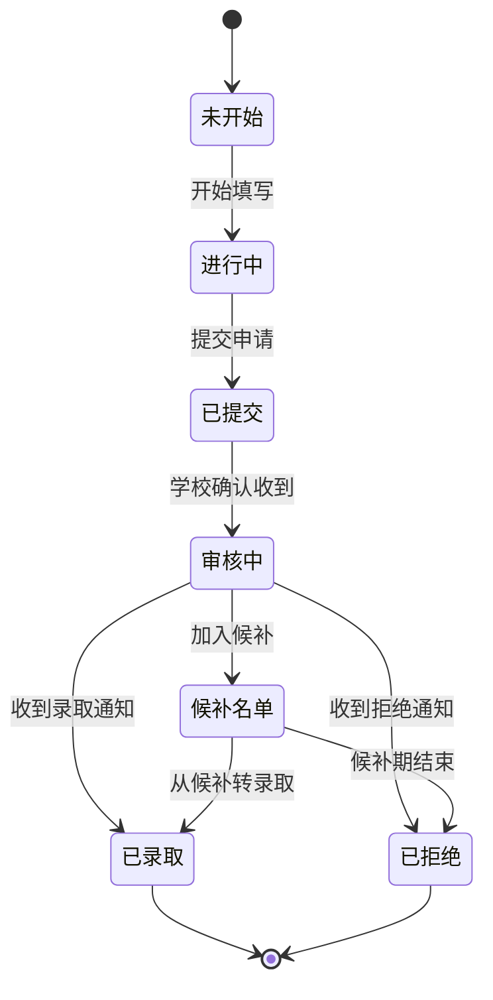
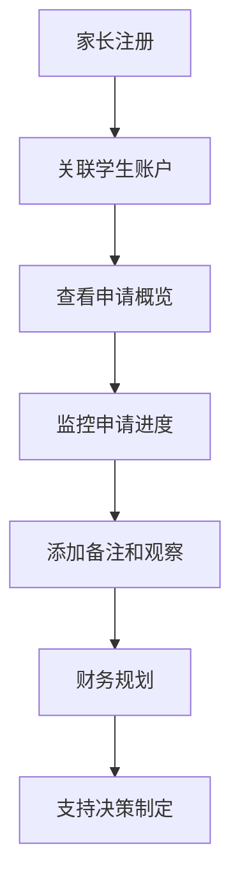

# 产品需求文档 (PRD)

## 项目概述

### 产品名称
大学申请追踪系统 (University Application Tracking System)

### 产品愿景
构建一个全面的大学申请管理平台，帮助学生、家长和老师高效管理大学申请流程，提供实时进度追踪、截止日期管理和决策支持。

### 目标用户
- **主要用户**：高中生（申请8-15所大学）
- **次要用户**：家长（监控和支持孩子的申请）
- **未来用户**：老师/顾问（指导多个学生）

### 核心价值主张
- 统一管理多个大学申请
- 实时追踪申请进度和截止日期
- 基于角色的协作支持
- 智能提醒和决策辅助

## 用户角色与权限

### 1. 学生 (Student)
**权限范围**：
- 完整的申请CRUD操作
- 个人资料管理
- 大学搜索和选择
- 申请要求追踪

**核心需求**：
- 管理申请组合
- 追踪申请进度
- 监控截止日期
- 比较大学选项

### 2. 家长 (Parent)
**权限范围**：
- 孩子申请的只读访问
- 添加备注和观察

**核心需求**：
- 监控孩子申请状态
- 支持申请规划
- 与孩子协作沟通

### 3. 老师/顾问 (Teacher/Counselor) - 未来扩展
**权限范围**：
- 多个学生的申请概览
- 指导建议和备注
- 推荐信管理
- 统计分析查看

## 页面架构与功能规格

### 1. 认证页面

#### 1.1 登录页面 (/login)
**功能**：
- 邮箱/密码登录

**UI组件**：
- 登录表单
- 验证错误提示
- 加载状态指示器

### 2. 学生端页面

#### 2.1 学生仪表板 (/dashboard)
**核心功能**：
- 申请概览卡片
- 进度可视化
- 紧急任务提醒
- 快速统计

**页面布局**：
```
┌─────────────────────────────────────────────────────────┐
│ Header: 导航栏 + 用户信息 + 通知                          │
├─────────────────────────────────────────────────────────┤
│ 快速统计卡片区域                                         │
│ [总申请数] [已提交] [待处理] [已收到决定]                  │
├─────────────────────────────────────────────────────────┤
│ 主要内容区域                                             │
│ ┌─────────────────┐ ┌─────────────────────────────────┐ │
│ │ 申请进度概览     │ │ 即将到期的截止日期               │ │
│ │ - 进度条        │ │ - 日历视图                      │ │
│ │ - 状态分布      │ │ - 紧急任务列表                  │ │
│ └─────────────────┘ └─────────────────────────────────┘ │
│ ┌─────────────────────────────────────────────────────┐ │
│ │ 菜单                                            │ │
│ │ - 大学搜索                                          │ │
│ │ - 申请管理                                           │ │
│ │ - 个人资料                                          │ │
│ └─────────────────────────────────────────────────────┘ │
└─────────────────────────────────────────────────────────┘
```

**数据展示**：
- 申请总数、已提交数、待处理数、已收到决定数
- 申请状态分布饼图
- 进度条显示整体完成度
- 即将到期的截止日期（7天内）

#### 2.2 申请管理页面 (/applications)
**核心功能**：
- 申请列表展示
- 申请状态筛选
- 申请详情查看
- 新增/编辑申请

**页面布局**：
```
┌─────────────────────────────────────────────────────────┐
│ 页面标题 + 新增申请按钮                                   │
├─────────────────────────────────────────────────────────┤
│ 筛选和搜索栏                                             │
│ [状态筛选] [申请类型] [截止日期] [搜索框]                  │
├─────────────────────────────────────────────────────────┤
│ 申请列表                                                 │
│ ┌─────────────────────────────────────────────────────┐ │
│ │ 申请卡片 1                                           │ │
│ │ [大学名称] [申请类型] [状态] [截止日期] [操作按钮]     │ │
│ └─────────────────────────────────────────────────────┘ │
│ ┌─────────────────────────────────────────────────────┐ │
│ │ 申请卡片 2                                           │ │
│ └─────────────────────────────────────────────────────┘ │
└─────────────────────────────────────────────────────────┘
```

**申请卡片信息**：
- 大学名称
- 申请类型（ED/EA/RD/Rolling）
- 当前状态（未开始/进行中/已提交/审核中/已决定）
- 截止日期（带颜色编码）
- 进度百分比
- 快速操作按钮（编辑/删除）

**筛选选项**：
- 申请状态：全部/未开始/进行中/已提交/审核中/已决定
- 申请类型：全部/ED/EA/RD/Rolling
- 截止日期：全部/本周/本月/已过期
- 决定结果：全部/录取/拒绝/候补

#### 2.3 申请详情页面 (/applications/[id])
**核心功能**：
- 申请完整信息展示
- 要求清单管理
- 文档上传（不需要真正上传到服务器，也不需要校验）
- 进度追踪

**页面布局**：
```
┌─────────────────────────────────────────────────────────┐
│ 申请标题 + 状态徽章 + 操作按钮                            │
├─────────────────────────────────────────────────────────┤
│ ┌─────────────────┐ ┌─────────────────────────────────┐ │
│ │ 基本信息         │ │ 进度追踪                        │ │
│ │ - 大学信息      │ │ - 时间线                        │ │
│ │ - 申请类型      │ │ - 状态更新                      │ │
│ │ - 截止日期      │ │ - 里程碑                        │ │
│ └─────────────────┘ └─────────────────────────────────┘ │
├─────────────────────────────────────────────────────────┤
│ 申请要求清单                                             │
│ ┌─────────────────────────────────────────────────────┐ │
│ │ [✓] 个人陈述 (已完成)                                │ │
│ │ [○] 推荐信 (进行中)                                  │ │
│ │ [○] 成绩单 (未开始)                                  │ │
│ └─────────────────────────────────────────────────────┘ │
├─────────────────────────────────────────────────────────┤
│ 文档管理                                                 │
│ [上传文档] [文档列表] [预览/下载]                         │
└─────────────────────────────────────────────────────────┘
```

**详细信息包含**：
- 大学基本信息（名称、位置、排名、录取率）
- 申请信息（类型、截止日期、申请费、状态）
- 要求清单（论文、推荐信、成绩单等）
- 截止日期
- 家长备注和观察

#### 2.4 新增/编辑申请页面 (/applications/new, /applications/[id]/edit)
**核心功能**：
- 申请信息表单
- 大学选择
- 截止日期自动获取

**表单字段**：
- 大学选择（搜索下拉框）
- 申请类型选择
- 截止日期显示（根据大学表deadlines字段和申请类型自动获取，只读）
- 个人备注

**截止日期逻辑**：
- 当用户选择大学和申请类型后，系统自动从大学表的deadlines字段中获取对应的截止日期
- 截止日期字段为只读显示，用户无法手动修改
- 如果大学表中没有对应申请类型的截止日期，则显示"待确认"并提示用户联系学校确认

#### 2.5 大学搜索页面 (/universities)
**核心功能**：
- 大学数据库搜索
- 高级筛选
- 大学比较

**页面布局**：
```
┌─────────────────────────────────────────────────────────┐
│ 搜索栏 + 筛选按钮                                         │
├─────────────────────────────────────────────────────────┤
│ ┌─────────────┐ ┌─────────────────────────────────────┐ │
│ │ 筛选侧边栏   │ │ 大学列表                            │ │
│ │ - 地理位置  │ │ ┌─────────────────────────────────┐ │ │
│ │ - 专业      │ │ │ 大学卡片 1                       │ │ │
│ │ - 排名      │ │ │ [名称] [位置] [排名] [录取率]    │ │ │
│ │ - 录取率    │ │ │ [学费] [申请费] [操作按钮]       │ │ │
│ │ - 学费范围  │ │ └─────────────────────────────────┘ │ │
│ │ - 申请系统  │ │ ┌─────────────────────────────────┐ │ │
│ └─────────────┘ │ │ 大学卡片 2                       │ │ │
│                 │ └─────────────────────────────────┘ │ │
│                 └─────────────────────────────────────┘ │
└─────────────────────────────────────────────────────────┘
```

**筛选条件**：
- 地理位置：国家、州/省、城市
- 专业领域：工程、商科、文科、理科等
- 排名范围：US News排名区间
- 录取率：<10%, 10-30%, 30-50%, >50%
- 学费范围：学费区间
- 申请系统：Common App、Coalition、直接申请
- 申请截止日期：按月份筛选

**大学卡片信息**：
- 大学名称和logo
- 地理位置
- US News排名
- 录取率
- 学费信息
- 申请截止日期
- 操作按钮（添加申请、收藏）

#### 2.6 大学比较页面 (/universities/compare)
**核心功能**：
- 并排比较多所大学
- 关键指标对比
- 优劣势分析
- 决策辅助

**比较维度**：
- 基本信息对比
- 学术排名对比
- 录取对比
- 费用对比
- 地理位置对比
- 专业设置对比

#### 2.7 个人资料页面 (/profile)
**核心功能**：
- 个人信息编辑

**信息分类**：
- 基本信息：姓名、邮箱
- 学术信息：毕业年份、GPA、SAT/ACT成绩、AP成绩、目标城市、专业

### 3. 家长端页面

#### 3.1 家长仪表板 (/parent/dashboard)
**核心功能**：
- 孩子申请概览
- 财务规划
- 沟通记录

**页面布局**：
```
┌─────────────────────────────────────────────────────────┐
│ 孩子选择器 + 概览统计                                     │
├─────────────────────────────────────────────────────────┤
│ ┌─────────────────┐ ┌─────────────────────────────────┐ │
│ │ 申请进度概览     │ │ 财务规划                        │ │
│ │ - 申请状态分布  │ │ - 预估费用                    │ │
│ │ - 截止日期提醒  │ │ - 学费成本                    │ │
│ └─────────────────┘ └─────────────────────────────────┘ │
├─────────────────────────────────────────────────────────┤
│ ┌─────────────────────────────────────────────────────┐ │
│ │ 沟通记录和备注                                       │ │
│ │ - 与孩子的讨论记录                                   │ │
│ └─────────────────────────────────────────────────────┘ │
└─────────────────────────────────────────────────────────┘
```

#### 3.2 申请监控页面 (/parent/applications)
**核心功能**：
- 孩子申请列表（只读）
- 申请详情查看
- 备注添加

**功能限制**：
- 只读访问申请信息
- 可以添加家长备注
- 不能修改申请内容

## 核心业务流程

### 1. 学生申请流程



### 2. 申请状态工作流



### 3. 家长监控流程


## 用户体验设计

### 1. 设计原则

- **简洁直观**：界面简洁，操作直观，减少学习成本
- **信息层次**：重要信息突出显示，次要信息适当弱化
- **一致性**：保持设计语言和交互模式的一致性
- **响应式**：适配各种设备和屏幕尺寸
- **无障碍**：遵循WCAG 2.1 AA标准

### 2. 视觉设计

**色彩系统**：
- 主色调：蓝色系（专业、可信赖）
- 辅助色：绿色（成功）、红色（警告）、橙色（提醒）
- 中性色：灰色系（文本、背景）

**字体系统**：
- 标题：Inter/SF Pro Display（现代、清晰）
- 正文：Inter/SF Pro Text（易读性好）
- 代码：JetBrains Mono（等宽字体）

**间距系统**：
- 基础单位：4px
- 常用间距：8px, 12px, 16px, 24px, 32px, 48px

### 3. 交互设计

**状态反馈**：
- 加载状态：骨架屏、进度条
- 成功状态：绿色提示、动画反馈
- 错误状态：红色提示、错误说明
- 空状态：友好的空状态插图和引导

**操作反馈**：
- 按钮点击：视觉反馈和触觉反馈
- 表单验证：实时验证和错误提示
- 数据保存：自动保存和手动保存提示

### 4. 响应式设计

**断点设置**：
- 移动端：< 768px
- 平板端：768px - 1024px
- 桌面端：> 1024px

**适配策略**：
- 移动端：单列布局，底部导航
- 平板端：双列布局，侧边导航
- 桌面端：多列布局，顶部导航

---

本PRD文档将作为项目开发的核心指导文档，所有功能开发和设计决策都应以此为准。文档将根据项目进展和用户反馈持续更新和完善。